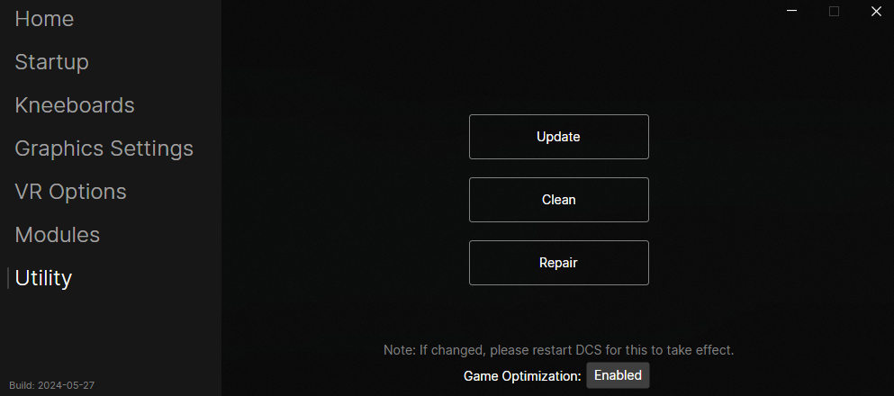

# FlightDeck Optimization

FlightDeck employs some common optimization methods usually done by running other applications alongside DCS. By doing the same techniques from FlightDeck, users do not need to use applications like ProcessLasso to still get the benefits.

## Optimization Strategies
1. Disable SMT (Simultaneous Multithreading) (Currently Disabled in the latest build)
   * Calculate and apply an affinity mask to use only physical cores
     * DCS will crash if you are using more than 32 threads (virtual cores)
     * Due to how DCS multi-threading is implemented, assigning DCS to only the P-cores seems to improve stutters and fps
2. Set process priority on critical applications for DCS
   * Sets DCS.exe process priority to High
   * Sets known peripheral processes' (VirtualDesktop, Oculus Server, SteamVR) priority to High
3. Disabled the first non P-core
   * Suggestion from Heatblur devs to improve DCS performance

## Future Optimization Strategies
1. Memory Management
   * DCS reserves a lot of physical and virtual memory and rarely releases it, this can be improved by using tools like Memory Cleaner, but a better implementation could be done inside FlightDeck

## How to Enable Optimization?
On the 'Utility' tab, at the bottom of the screen is a toggle to enable 'Game Optimization'
