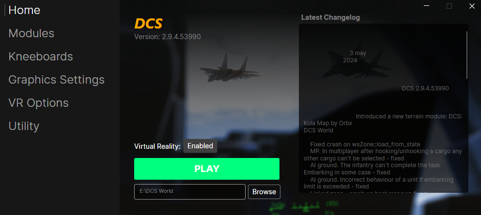
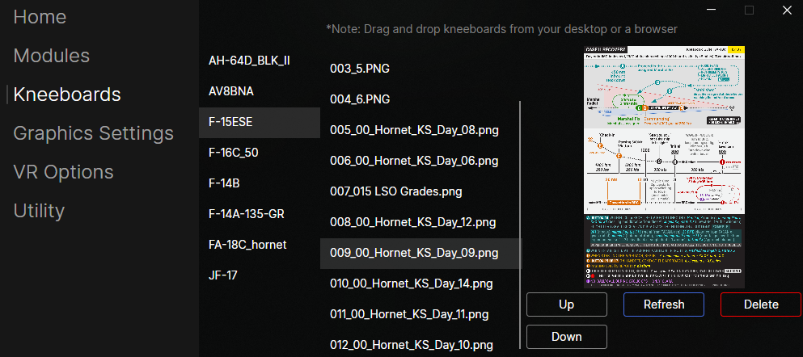

# FlightDeck

## What does FlightDeck do?
FlightDeck aims to do a variety of tasks that a virtual pilot would be encouraged to do outside of DCS. Some of these tasks include:
* Keeping DCS updated
  * FlightDeck will automatically check and prompt for update when a new update becomes available
* Toggling whether VR is used or not
* Managing kneeboards
  * FlightDeck allows you to drag-n-drop kneeboards from the web, your desktop, or other popular applications like Discord directly into your aircraft
  * FlightDeck allows you to reorder your kneeboards and how they appear in your aircraft
  * FlightDeck allows you to remove unused or unwanted kneeboards from your aircraft
* Changing any DCS setting that would require a restart
  * Any DCS setting that would force a restart has now been moved here and allows you to change those settings before launching the game thus removing the need to restart the game... since it hasn't been started yet.
* Cleaning and/or repairing DCS

## Managing Kneeboards
Flying with a virtual squadron and constantly getting updated kneeboards for your missions? This should help...

Note: This will rename all of your kneeboards. Please back them up before using this.

## How to Install FlightDeck (Using the installer)
1. Navigate [here](https://github.com/Rinzller/FlightDeck/releases)
2. Download the `FlightDeck-Installer.exe` from the latest release
3. Run the installer and follow the installer's instructions

## How to Install FlightDeck (Installing manually)
1. Navigate [here](https://github.com/Rinzller/FlightDeck/releases)
2. Download the `FlightDeck.exe` from the latest release

## FAQ
* Why did you make this when ED said they were working on a launcher?
  * I have had this lying around for ~2 years. With the news of ED working on their own, it inspired me to prepare this for public release so that it wouldn't go to waste
* Why is this not open-source?
  * I plan to open source this project after an inital grace period
* Why should I use the FlightDeck-Installer?
  * The FlightDeck is able to keep itself and the launcher updated automatically, but only if FlightDeck-Installer is used
  * FlightDeck needs to save your settings somewhere. FlightDeck-Installer will setup the folder for this
* Why does FlightDeck-Installer require Administrator priviledges?
  * This is needed to be able to install any application into folders like `Program-Files` and `Program-Files (x86)`

## Issues
If you encounter issues, please create an issue [here](https://github.com/Rinzller/FlightDeck/issues) and include the following information
* FlightDeck Build
  * This can be found in the bottom left of the window
* Any error message provided by either your OS or FlightDeck itself
* The DCS version you are running
  * If you have already set your install location in FlightDeck, you can get from the top of the Home tab

## Coming SoonTM
* Add 'Addons' tab to allow users to start other applications when they launch DCS. Programs like SRS, VoiceAttack, etc.
* Prettify the 'Latest Changelog' section on the 'Home' tab
* Add the weekly newsletter to the 'Home' tab
* Application framework conversion to Tauri
  * This will require a full rewrite but should reduce the memory used by the application by 80%

## For nerds
This application is built using ChatGPT and Avalonia. See https://avaloniaui.net/ for me details.
