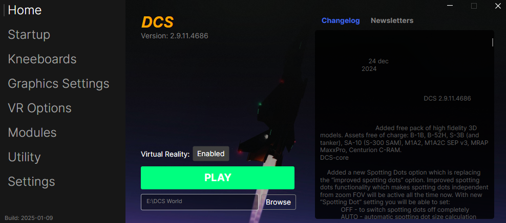
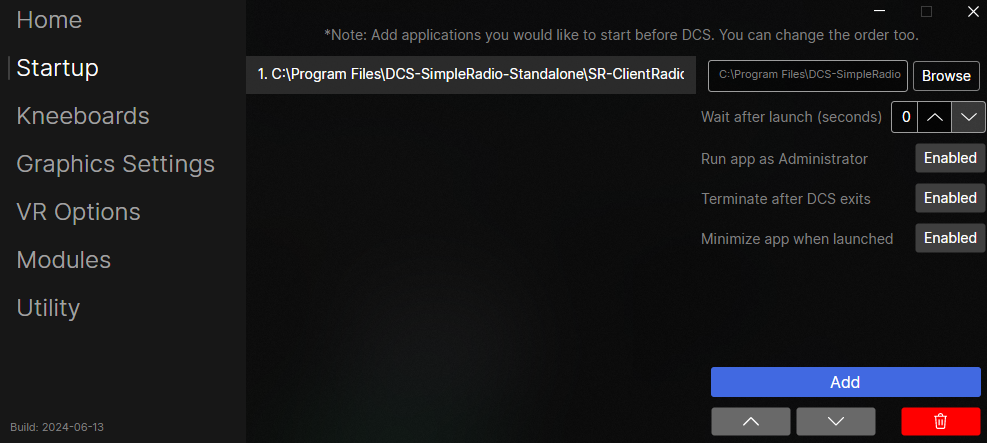

# FlightDeck

## What does FlightDeck do?
FlightDeck aims to do a variety of tasks that a virtual pilot would be encouraged to do outside of DCS. Some of these tasks include:
* Keeps DCS updated
  * FlightDeck will automatically check and prompt for update when a new update becomes available
  * FlightDeck will automatically clear your fxo and metashaders2 folders whenever the game is updated
* Toggles VR off and on
* Startup applications before starting DCS
  * Launch any application you want before launching DCS automatically
  * Ex. SRS, VoiceAttack, TobiiGamehub, Simshaker, etc.
* Game optimization... see below
* Manages kneeboards
  * FlightDeck allows you to drag-n-drop kneeboards from the web, your desktop, or other popular applications like Discord directly into your aircraft
  * FlightDeck allows you to reorder your kneeboards and how they appear in your aircraft
  * FlightDeck allows you to remove unused or unwanted kneeboards from your aircraft
* Change any DCS setting that would require a restart
  * Any DCS setting that would force a restart has now been moved here and allows you to change those settings before launching the game thus removing the need to restart the game... since it hasn't been started yet.
* Cleaning and/or repairing DCS

## Managing Kneeboards
Flying with a virtual squadron and constantly getting updated kneeboards for your missions? This should help...

## :exclamation: Important :exclamation:
* If you cannot see any kneeboards that you expect to be there, please ensure your kneeboard path is `Saved Games\DCS(DCS.openbeta)\Kneeboard`
* Please backup both your OptionsPresets found in `Saved Games\DCS(DCS.openbeta)\Config\OptionsPresets` and your kneeboards before using this

## Startup Applications before DCS
Add up to ten applications to launch before DCS launches...

## F15E Radar Fix Script (Utility Script)
I have added a script to set the system time back a year to temporarily fix the F15E radar issue. You can download the script from ~[here](https://github.com/Rinzller/FlightDeck/tree/main/Utils) and add it to your 'Startup' list (The script requires admin). If you have suggestions of scripts you would like me to add feel free to reach out.
* Download script and add it to your startup list
* Check 'Launch after DCS starts'
* Uncheck 'Terminate after DCS exits'
  * This script will set your system time back to normal when done though you will need terminate the script on the powershell window by pressing 'Enter'

## OS Requirements
* Windows 10 or Windows 11

## How to Install FlightDeck (Using the installer)
1. Navigate [here](https://github.com/Rinzller/FlightDeck/releases)
2. Download the `FlightDeck-Installer.exe` from the latest release
3. Run the installer and follow the installer's instructions

## How to Install FlightDeck (Installing manually)
1. Navigate [here](https://github.com/Rinzller/FlightDeck/releases)
2. Download the `FlightDeck.exe` from the latest release
3. Put it wherever you like though note that to uninstall everything you will need to remove `FlightDeck` from your `.APPDATA` folder

## How does FlightDeck do optimization?
I have provided a writeup on what FlightDeck is doing to help your game run a bit smoother. Check it out [here](.github/docs/optimization.md)

## FAQ
* I don't see my Flaming Cliffs aircraft in the Kneeboards tab?
  * Flaming Cliffs, unfortunately works a bit different than standalone modules and therefore will take some additional time to implement.
* Why did you make this when ED said they were working on a launcher?
  * I have had this lying around for ~2 years. With the news of ED working on their own, it inspired me to prepare this for public release so that it wouldn't go to waste
* Why is FlightDeck not open-source?
  * I plan to open source the entire project after an inital grace period
* Why should I use the FlightDeck-Installer?
  * The FlightDeck is able to keep itself and the launcher updated automatically, but only if FlightDeck-Installer is used
* My Installer keeps giving me errors when I try to install/update/uninstall
  * Please download the latest installer
  * If that does not fix your problem, create an [issue](https://github.com/Rinzller/FlightDeck/issues)
* Why does FlightDeck-Installer require Administrator priviledges?
  * This is needed to be able to install any application into folders like `Program-Files` and `Program-Files (x86)`
  * I have open-sourced the FlightDeck-Installer to be completely transparent as to what this application does

## Continue the conversation
Feel free to post any problems or suggestions on the [ED Forums](https://forum.dcs.world/topic/349094-introducing-flightdeck-a-simple-but-smart-launcher-for-dcs/) or in the FlightDeck [Discord](https://discord.gg/a6XuCu28)

## Issues
If you encounter specific issues, please create an issue [here](https://github.com/Rinzller/FlightDeck/issues) and include the following information
* FlightDeck Build
  * This can be found in the bottom left of the window
* Any error message provided by either your OS or FlightDeck itself
* The DCS version you are running
  * If you have already set your install location in FlightDeck, you can get from the top of the Home tab
* A detailed step-by-step walkthrough of what you did to encounter the issue

## Coming SoonTM
* Prettify the 'Latest Changelog' section on the 'Home' tab
* Add the weekly newsletter to the 'Home' tab
* Optimization, additional error handling and logging
* Add ability for the kneeboards feature to work with Flaming Cliffs
* Application framework conversion to Tauri
  * This will require a full rewrite but should reduce the memory used by the application by 80%

## Thank you to the testers behind FlightDeck!
- Grimm
- Colin
  
## For nerds
This application is built using ChatGPT and Avalonia. See https://avaloniaui.net/ for more details.
